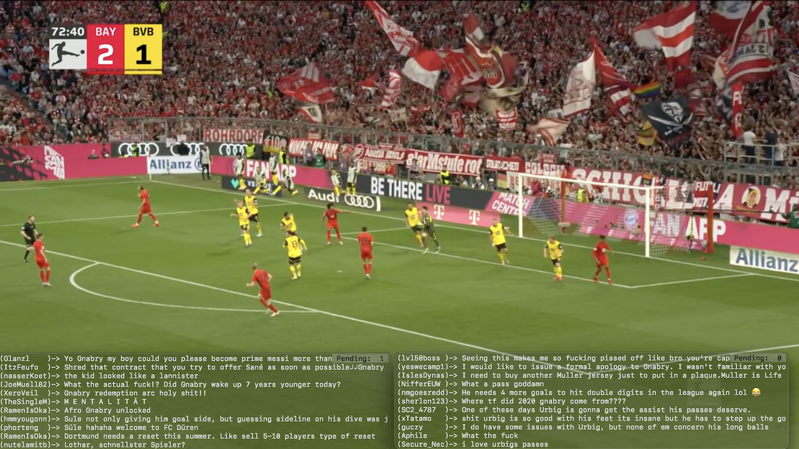

# rlctail



Tail (live stream) comments on a Reddit post. This is handy when watching
soccer games or other sporting evets as well as during rapidly developing world
events.  The Reddit app used to have a "live" sort mode for comments that
basically did this, however in early 2024, this feature was removed from the
app. Luckily it is still possible to implement the functionality using the
Reddit API.

Additional features:
* Comments can be delayed by a specified number of seconds (handy when your
stream is behind) 
* Display will adjust dynamically to the width of the terminal window
* Number of total pending comments is displayed in the top-right corner
* If more than one instances of rlctail are running at the same time, this
should be specified using the -n option. This will make rlctail adjust the
frequency of its requests to Reddit so it stays under the query limit of the
Reddit API's free tier


```
usage:

  Tail live comments on post:
      rlctail <reddit_post_url>

  Supported options:

      -d <delaysec>
              Delay comment display by this many seconds

      -f      Full comment display mode (default is compact display)

      -n <instance cnt>
              Number of concurrent processes

      -u <usrcredsfile>
              Alternate user credentials file

      -a <appcredsfile>
              Alternate app credentials file

      -h      Print this help text and exit
```

Setup:

1) Put Reddit user credendials in .rlctail_usercreds.json:

```
{
    "username": "your_username",
    "password": "your_password"

}
```
2) Put app credentials in .rlctail_appcreds.json:
```
{
    "clientid": "app_clientid",
    "clientsecret": "app_clientsecret""

}
```

2) Make sure permissions for .rlctail_usercreds.json and
   .rlctail_appcreds.jsonare are set to 600. The program
   will refuse to run unless both files' permissions are 600
3) Make sure .rlctail_usercreds.json and .rlctail_appcreds.json are listed
   in .gitignore. *** DO NOT STORE CREDENTIALS IN SOURCE CONTROL ***

